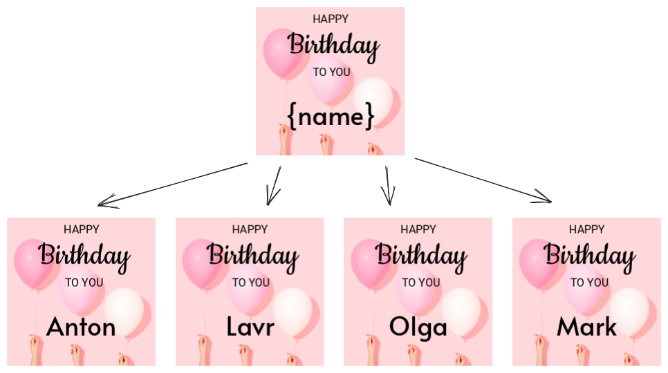

Leverage the capabilities of the Polotno SDK to craft templates that incorporate dynamic variables. This feature is useful for generating a variety of similar designs that vary in text or imagery.



You have full flexibility to build your own template system and even UI for it if needed. The workflow is simple:

1. Create a design with some variables in it.
2. Export design as JSON.
3. Save this JSON to the database/backend.
4. When you need to create a new design or export it, load JSON from the database and replace variables with real data.
5. Load or export the generated JSON.

Every design in Polotno can be represented as JSON via `store.toJSON()` function. Now it is up to you to decide how to create variations of this JSON. Here are several examples.

## Simple text replacement

As a part of your application convention you can use `{variable}` syntax to mark places where you want to replace text. Users of the editor may manually type this text or you can provide some UI for it.

```ts
store.activePage.addElement({
  type: 'text',
  // lets use name variable
  text: 'Hello {name}!',
});
```

When you want to generate a new design or export it, you can replace `{name}` with a real name. Here is a pseudo code for the backend:

```ts
const json = loadJSONFromDatabase();
const names = ['John', 'Mike', 'Anna'];
// do bulk export
for (const name of names) {
  // we need to replace {name} with real name
  // ideally you should loop over all text elements and replace text there
  // but we can do a simple string replace for this example
  const jsonString = JSON.stringify(json);
  const newJson = JSON.parse(jsonString.replace('{name}', name));
  // export newJson
  await convertJSONToImage(newJson);
}
```

## Image replacement

You can set up a similar workflow for images. To mark some images as variable you can use `custom` attribute of `image` element. It is a free-form object that you can use to store any data. You can make your own UI where users can change this data.

```ts
store.activePage.addElement({
  type: 'image',
  src: 'https://example.com/placeholder.png',
  custom: {
    // lets use avatar variable
    variable: 'avatar',
  },
});
```

Then on the backend you can replace `src` of this image with a real image URL based on information from the `custom` attribute.

```ts
// util function to handle deep traversal of json
const forEveryChild = (node: any, cb: (n: any) => void) => {
  if (node.children) {
    node.children.forEach((child: any) => {
      cb(child);
      forEveryChild(child, cb);
    });
  }
};

const json = loadJSONFromDatabase();
const avatars = [
  'https://example.com/avatar1.png',
  'https://example.com/avatar2.png',
];
// do bulk export
for (const avatar of avatars) {
  // find all avatar images in the json
  json.pages.forEach((page: any) => {
    forEveryChild(page, (child) => {
      if (child.type === 'image' && child.custom?.variable === 'avatar') {
        child.src = avatar;
      }
    });
  });
  // export json
  await convertJSONToImage(json);
}
```

The demo below shows how to replace text in the design. The demo specifies only one variable `{name}` but you can add more variables according to your application logic.

Click the "Preview" button to see how generation works.

## Live demo

<Sandbox github="polotno-project/polotno-docs/tree/main/examples/polotno-variables" />


