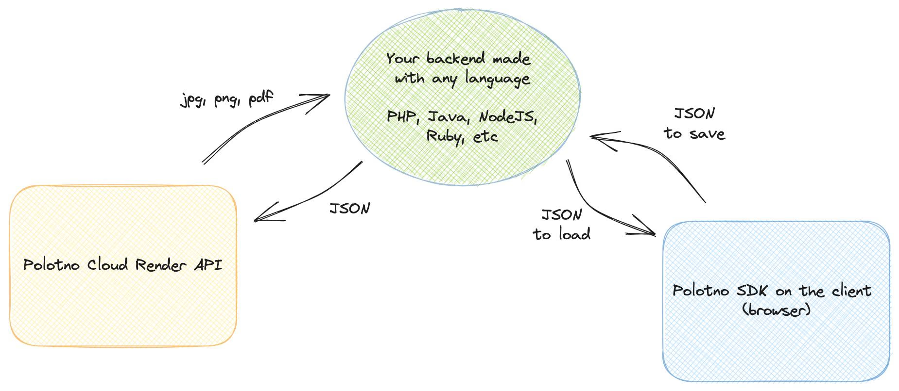

## What is Cloud Render API?

Using Polotno SDK, you can generate images directly on the client. But sometimes you need to generate images on the backend. For example, if you want to generate a 1,000 images with different text on it or if you want to simply offload rendering work from the client.

Polotno Cloud Render API is a managed rendering service that allows you to generate images, PDFs, and videos in the cloud without any backend infrastructure. You can use it to generate exports on the fly or to generate them in bulk for automated design workflows.



### Pricing

Cloud Render API is available for any subscribers at an additional [price](https://polotno.com/pricing).

## Before you start

(!) Important: all finished jobs will expire in 1 week. Such jobs will be deleted from the database and all render artifacts (images, PDF, videos, etc) are removed from file storage. Make sure to download the export result. If you need a persistent file store, please [contact us](https://polotno.com/contact).

## What does it look like?

### 1. Create render job

Send a POST request to schedule a rendering job.

```ts
const req = await fetch('https://api.polotno.com/api/renders?KEY=YOUR_API_KEY', {
  method: 'POST',
  headers: {
    // it is important to set a json content type
    'Content-Type': 'application/json',
  },
  body: JSON.stringify({
    // polotno json from store.toJSON()
    design: json,
    // here you can pass other render options
    pixelRatio: 1,
    // see below for full details of options
  }),
});

const job = await req.json();

console.log(job);
```

It will return a JSON like this:

```json
{
  "id": "fp1f2rtva",
  "status": "scheduled",
  "output": null,
  "error": "",
  "created_at": "2024-05-15T01:41:55.913628+00:00",
  "completed_at": null,
  "started_at": null,
  "updated_at": null,
  "progress": 0,
  "logs": ""
}
```

### Check render job status

```ts
// replace jobId with real id of the job
const req = await fetch(`https://api.polotno.com/api/renders/jobId?KEY=YOUR_API_KEY`);
const job = await req.json();

console.log(job);

if (job.status === 'done') {
  console.log(job.output); // link to file, valid only for 7 days after job complete
}
```

### Options

- **design**: json (required) — data from Polotno export `store.toJSON()`. You can generate such JSON on the fly on your backend (e.g. replace text dynamically).
- **format**: string — file format of generated result. One of: `png` (default), `jpeg`, `pdf`, `gif`, `mp4`.
- **webhook**: string — URL to receive HTTP POST notifications with the full job payload.
- **pixelRatio**: number — quality modifier. `0.5` reduces width/height by 2; values > 1 increase quality (and size).
- **ignoreBackground**: boolean — remove page background on export (default: false).
- **includeBleed**: boolean — render bleed areas (default: false).
- **htmlTextRenderEnabled**: boolean — enable [Rich Text](/docs/rich-text) rendering for text elements (default: false).
- **textVerticalResizeEnabled**: boolean — enable [Vertically Resized Text](/docs/vertical-text-resize) (default: false).
- **skipFontError**: boolean — continue if font loading fails (default: false).
- **skipImageError**: boolean — continue if image loading fails (default: false).
- **textOverflow**: string — overwrite [text overflow](/docs/text-overflow) logic. Default: `change-font-size`. Other values: `resize`, `ellipsis`.
- **vector**: boolean — make `pdf` in vector format (selectable text). Alpha feature (default: false).
- **color**: object — control color space and profile:

```json
{
  "color": {
    "space": "CMYK",
    "profile": "FOGRA39"
  }
}
```

### See a list of created jobs

```ts
const req = await fetch('https://api.polotno.com/api/renders/list?KEY=YOUR_API_KEY&page=1&per_page=100');
const job = await req.json();

console.log(job.renders);
```

### Synchronous request

Use `Prefer: 'wait'` for quick renders (e.g., image). The request may still return before completion for long renders (e.g., video).

```ts
const req = await fetch('https://api.polotno.com/api/renders?KEY=YOUR_API_KEY', {
  method: 'POST',
  headers: {
    'Content-Type': 'application/json',
    Prefer: 'wait'
  },
  body: JSON.stringify({
    design: json,
    pixelRatio: 1,
  }),
});

const job = await req.json();

if (job.status === 'error' || job.status === 'done') {
  // handle result
} else {
  // job may still be running; poll status
}
```

## Legacy API Documentation (Ongoing Support)

```ts
const req = await fetch('https://api.polotno.com/api/render?KEY=YOUR_API_KEY', {
  method: 'POST',
  headers: {
    'Content-Type': 'application/json',
  },
  body: JSON.stringify({
    design: json,
    outputFormat: 'dataURL',
    exportOptions: {},
  }),
});

const { url } = await req.json();

document.getElementById('image').src = url;
```

When you send a request to the API, pass JSON in the request body:

```json
{
  "design": {},
  "outputFormat": "dataURL",
  "exportOptions": {}
}
```

### legacy fields

- **design** — JSON from `store.toJSON()`.
- **outputFormat** — response format: `dataURL` (default), `url`, or `file`.
  - `dataURL`/`url` returns `{ url: '...' }` where `url` is the generated image URL.
  - `file` returns a file buffer (for direct backend saving).

⚠️ Important: Cloud API has a 5 MB payload limit. Large outputs may not work with `dataURL` or `file`. Use `url` instead.
URLs generated with `url` format expire in 24 hours. Set up your own storage if you need persistent access.

- **format** — `png` (default), `jpeg`, `pdf`.
- **exportOptions** — forwarded to polotno‑node export (similar to `store.toDataURL()`):

```json
{
  "design": {},
  "exportOptions": {
    "pixelRatio": 1,
    "ignoreBackground": false,
    "includeBleed": false,
    "htmlTextRenderEnabled": false,
    "textVerticalResizeEnabled": false,
    "skipFontError": true,
    "textOverflow": "change-font-size"
  }
}
```

## Live demo

<Sandbox github="polotno-project/polotno-docs/tree/main/examples/polotno-cloud-render" />
