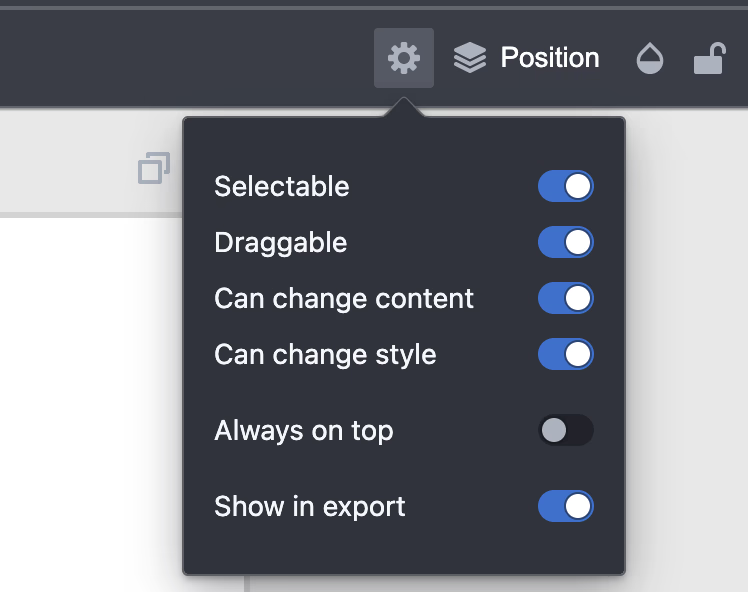

User roles in **Polotno Editor** change **UI behavior** for different workflows. Polotno has two built-in roles: **admin** and **user**.

Note: Roles only affect **UI interactions**. Programmatic API (`element.set()`, `store.find()`, etc.) always works regardless of role.

## Roles overview

| Role | Can select locked elements | Access to locking UI | Typical use case |
|------|---------------------------|---------------------|------------------|
| **user** (default) | No | No | End users editing within defined constraints |
| **admin** | Yes | Yes | Template creators, designers setting up restrictions |

## Setting a role

```ts
// Set admin role (typically for template creators)
store.setRole('admin');

// Set user role (default, for end users)
store.setRole('user');

// Check current role
console.log(store.role); // 'admin' or 'user'
```

## Admin mode capabilities

When **admin** mode is enabled, the UI changes:

1. **Select locked elements** — Can click and select elements marked as `selectable: false`
2. **Access locking UI** — Extra controls appear in the toolbar to set element restrictions
3. **Configure export behavior** — Toggle `showInExport` to hide elements from final output
4. **Fine-grained locking** — Control which aspects of an element can be edited (see [Element Locking](/docs/element-locking))



## Template creator workflow

1. **Enable admin mode** — `store.setRole('admin')` to access all elements via UI
2. **Lock background elements** — Mark logos, borders, and guides as `selectable: false`
3. **Restrict editing** — Use `contentEditable: false` on text elements to prevent content changes
4. **Hide guides from export** — Set `showInExport: false` on helper elements
5. **Switch to user role** — Test the template with `store.setRole('user')` to verify restrictions

## Use cases

### Non-editable overlays

Use admin mode to create watermarks or logos that regular users can't select:

```ts
// As admin, create non-selectable element
store.activePage.addElement({
  type: 'image',
  src: 'logo.png',
  selectable: false,  // Regular users can't click it
  removable: false,
  alwaysOnTop: true,
});

// As admin, you can still select it by clicking
// Regular users (role: 'user') cannot
```

### Editable content with locked styling

Create template placeholders where users can change text but not styling:

```ts
// Create element with mixed locks
store.activePage.addElement({
  type: 'text',
  text: 'Edit this text',
  contentEditable: true,  // Can edit text content
  styleEditable: false,   // Cannot change font, color, etc.
  draggable: false,       // Cannot move
  resizable: false,       // Cannot resize
});

// Admin can access locking UI to adjust these settings
// Regular users see the restrictions enforced
```

### Export-only guides

Create guide layers visible during editing but hidden in exports:

```ts
store.activePage.addElement({
  type: 'figure',
  subType: 'rect',
  stroke: 'red',
  strokeWidth: 2,
  fill: 'transparent',
  selectable: false,
  showInExport: false, // Hidden in export
});

// Admin can toggle this via UI
// Regular users can't interact with it
```

## Role vs. programmatic API

**Role affects UI only.** The programmatic API always works:

```ts
// Programmatic API works the same in any role
element.set({ draggable: false, removable: false });

// No need to change role for programmatic operations
const locked = store.find((el) => el.selectable === false);
locked.forEach((el) => el.set({ x: 100 })); // Works in any role
```

## Custom locking UI

Admin mode provides built-in UI for controlling locks. If you need more flexibility or want to integrate locking controls into your own interface, you can build custom UI.

See [Element Locking](/docs/element-locking) for:
- Complete locking API reference
- Live demo of custom locking UI
- Examples of building your own lock controls

## Live demo

<Sandbox github="polotno-project/polotno-docs/tree/main/examples/polotno-admin-role" />


