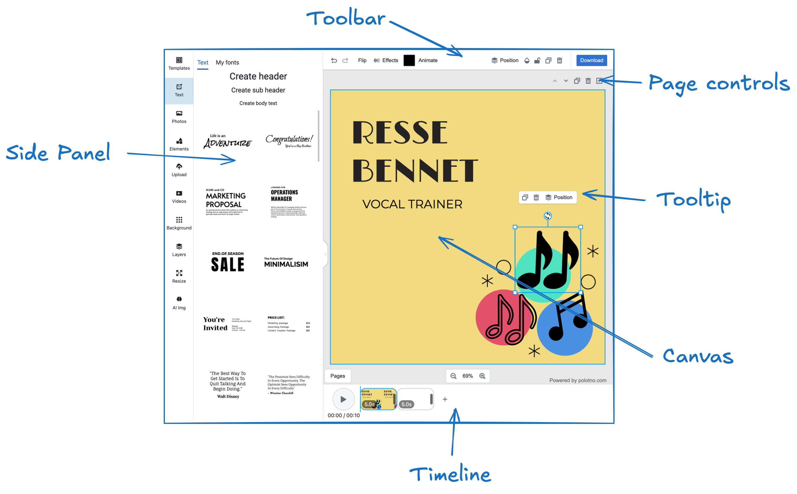

# What can I customize in Polotno editor?

First, let's talk about the user interface.

The Polotno editor has several main components:

## Full Control of the Side Panel

You have complete control over the Side Panel. You can remove the default panels, add your own, and customize their content entirely. For instance, you can create a panel that loads images directly from your backend. Check out the [Side Panel Overview](/docs/side-panel-overview) for more information.

## Toolbar, Page Controls, and Tooltip Customization

You can modify, remove, or add controls and buttons in the [Toolbar](/docs/toolbar), [Page Controls](/docs/workspace), and [Tooltip](/docs/tooltip), allowing you to tailor the interface to your needs.

## Timeline Customization

Currently, the **Timeline** component is not customizable. However, you can remove it and implement your own version using the [Store API](/docs/store).

## Canvas Customization

The Canvas component offers several style customization options. You can modify properties like background color and selection tool colors. For more options, refer to the [Workspace Documentation](/docs/workspace).

## General Style Customization

You can also use [CSS to overwrite](/docs/theme-and-ui-styles) and customize the general styles of the editor.

## Data Loading and Export

You have full control over how data is loaded into the editor, saved, and exported.

For example:

- Load custom templates or a specific user's design from your backend.
- Save a JSON file to a local computer with a button click.
- Automatically send requests to your backend with design data on any changes.
- Upload design previews or exports to an S3 bucket.

The [Store API](/docs/store) allows you to implement all of these features, ensuring your data flow fits seamlessly with your infrastructure.
