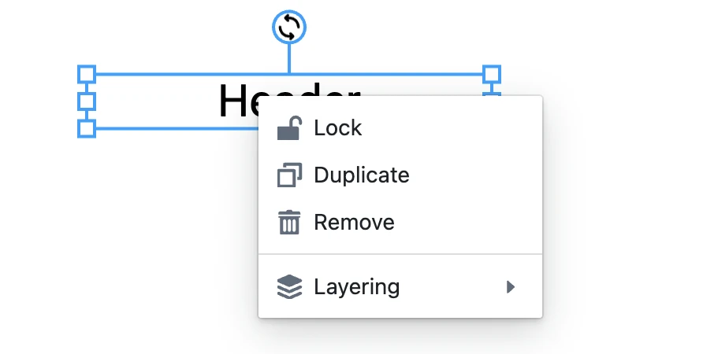

**ContextMenu** is a UI component that is rendered on right-click inside the page/workspace.



## How to customize ContextMenu?

You can pass a custom `ContextMenu` component into `<Workspace />` to overwrite the default one.

Warning: you will have to fully control every aspect of the context menu.

```tsx
import Workspace from 'polotno/canvas/workspace';

const ContextMenu = ({ store }) => {
  return <div>MyContextMenu</div>;
};

const App = ({ store }) => {
  return (
    <div
      style={{
        display: 'flex',
        height: '100%',
        margin: 'auto',
        flex: 1,
        flexDirection: 'column',
        position: 'relative',
      }}
    >
      <Workspace
        store={store}
        components={{
          ContextMenu,
        }}
      />
    </div>
  );
};
```

## How to disable ContextMenu?

Pass a `ContextMenu` component that renders `null` to disable it.

```tsx
import Workspace from 'polotno/canvas/workspace';

const ContextMenu = () => null;

const App = ({ store }) => {
  return (
    <div
      style={{
        display: 'flex',
        height: '100%',
        margin: 'auto',
        flex: 1,
        flexDirection: 'column',
        position: 'relative',
      }}
    >
      <Workspace store={store} components={{ ContextMenu }} />
    </div>
  );
};
```


