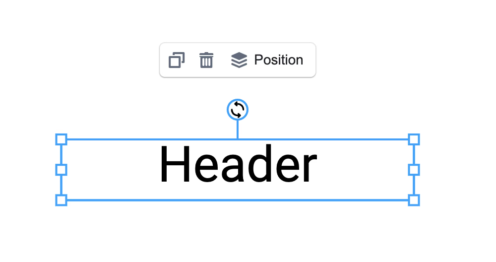

**Tooltip**, a UI component similar to the [Toolbar](./toolbar), is designed to change elements on the canvas, reorder and align them. It is rendered next to a selected element — a behavior you can modify.



## How to customize Tooltip?

Similar to the [Toolbar](./toolbar), Tooltip supports a special `components` property to add/change/remove most of its UI parts.

Pass a component using the name format `TypeName`, where `Type` refers to the element `type`. For example: `TextFill`. You can use built-in element types like `Text`, `Image`, `svg`. You can also use the `Many` prefix when several elements are selected. Additionally, you can define your own components for any element type, e.g. `ImageAlertButton`.

```tsx
import { observer } from 'mobx-react-lite';
import { Workspace } from 'polotno/canvas/workspace';
import { Tooltip } from 'polotno/canvas/tooltip';

const MyColorPicker = observer(({ store, element, elements }) => {
  // store - main polotno store object
  // elements - array of selected elements. Same as store.selectedElements
  // element - first selected element. Same as store.selectedElements[0]
  return (
    <div>
      <input
        type="color"
        value={element.fill}
        onChange={(e) => {
          element.set({
            fill: e.target.value,
          });
        }}
      />
    </div>
  );
});

const App = ({ store }) => {
  return (
    <div
      style={{
        display: 'flex',
        height: '100%',
        margin: 'auto',
        flex: 1,
        flexDirection: 'column',
        position: 'relative',
      }}
    >
      <Workspace
        store={store}
        components={{
          Tooltip,
          TextFill: MyColorPicker,
        }}
      />
    </div>
  );
};
```

Tip for images: prefix the component name with `Image`, for example `ImageActionButton: MyComponent`.

## How to disable Tooltip?

Pass a `Tooltip` component that renders `null`.

```tsx
import { Toolbar } from 'polotno/toolbar/toolbar';
import { Workspace } from 'polotno/canvas/workspace';

const Tooltip = () => null;

const App = ({ store }) => {
  return (
    <div
      style={{
        display: 'flex',
        height: '100%',
        margin: 'auto',
        flex: 1,
        flexDirection: 'column',
        position: 'relative',
      }}
    >
      <Toolbar store={store} />
      <Workspace store={store} components={{ Tooltip }} />
    </div>
  );
};
```

## Live demo

<Sandbox github="polotno-project/polotno-docs/tree/main/examples/polotno-tooltip" />


