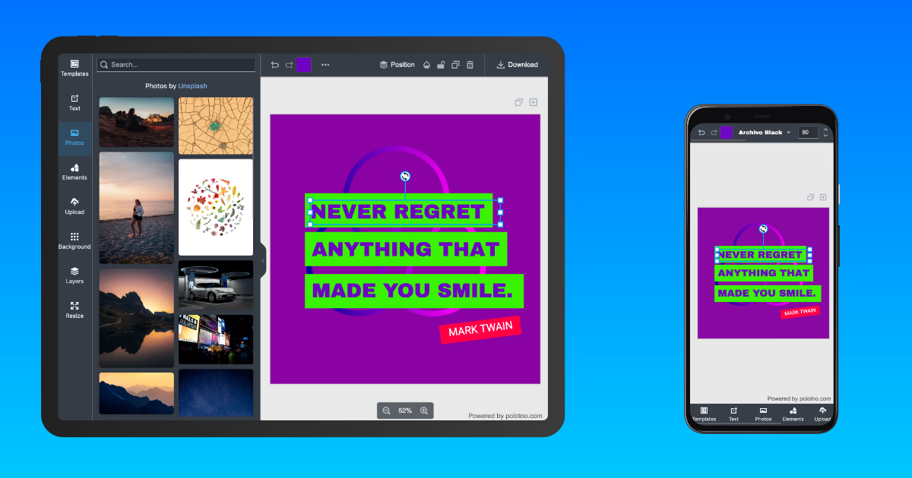

## Does Polotno support mobile and touch devices?

Yes. You can use it on mobile and touch devices to create beautiful designs. Polotno adapts to mobile and touch environments, ensuring a smooth, optimized design experience on any screen size.



Note: Polotno SDK is primarily designed to work in web environments (not native apps). However, you can still use it in your app where a WebView is available.

## How to toggle mobile mode on large screens?

In some cases you may want to force compact/mobile view on a large screen (e.g., when embedding the editor in a sidebar). Add the `polotno-mobile` class to any parent container of the Polotno editor, such as the `body` tag:

```html
<body class="polotno-mobile">
  <div id="root"></div>
</body>
```

## Live demo

<Sandbox github="polotno-project/polotno-site/tree/source/examples/polotno-mobile" />


